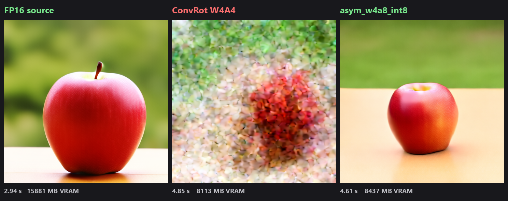
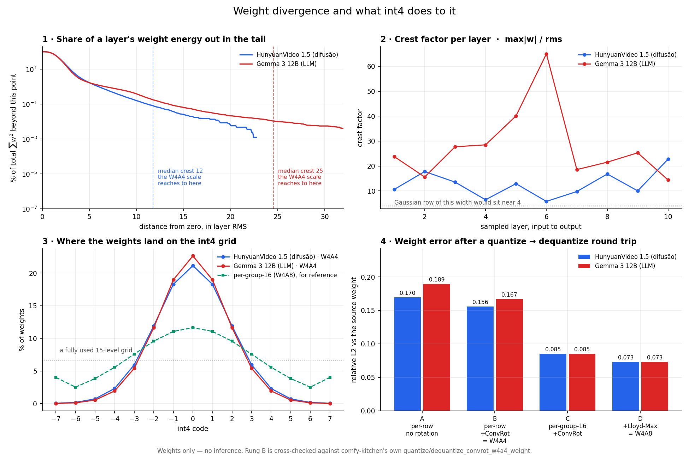

# ComfyUI ConvRot Quant

4-bit quantization for ComfyUI checkpoints that actually executes its kernel instead of quietly
dequantizing back to a full-precision GEMM — plus the measurements showing which 4-bit format is
worth using.

**Use `tools/quant_w4a8.py`. Do not use W4A4.** That is not a style preference; it is what the
numbers said.



HunyuanVideo 1.5, RTX 3090, identical prompt, seed, steps, resolution, sampler and scheduler.
Model resident, seeds varied so ComfyUI could not serve a cached result. Times are ComfyUI's own
`Prompt executed`.

| Format | Time | VRAM staged | On disk | Image |
| --- | --- | --- | --- | --- |
| FP16 source | **2.94 s** | 15881 MB | 15.51 GiB | correct |
| ConvRot W4A4 | 4.85 s | 8113 MB | 7.92 GiB | **destroyed** |
| **asym_w4a8_int8** | **4.61 s** | 8437 MB | 8.24 GiB | **correct** |

ConvRot W4A4 is slower than FP16 *and* destroys the output, so its VRAM saving buys nothing. W4A8
is faster than W4A4 and produces a correct image for 4% more disk: **1.57x slower than FP16 for
1.88x less VRAM**, which is a real trade.

W4A4 was tested at Hadamard group sizes 256, 64 and 16. All three are unusable; the parameter does
not rescue it. The ConvRot paper reports 2.26x speedup on FLUX.1-dev; that did not reproduce here.

The W4A4 converter is kept because the format is a useful fixture for kernel and loader work, and
because a negative result with a reproduction is worth more than silence.

## What actually breaks: the activations, in both model families

Both formats keep 4-bit **weights**. The one that works keeps 8-bit **activations**. It is easy to
assume this is something about diffusion — that a continuous latent accumulates error where an
LLM's discrete token choice snaps it away each step. That story is wrong, and `tools/gemma_chat.py`
kills it in one run.

Gemma 3 12B, greedy decoding, identical prompt, through ComfyUI's own loader and generation loop.
The middle row is the same W4A4 checkpoint as the bottom row — identical 4-bit weights, byte for
byte — with the weights retyped so `comfy/ops.py` dequantizes them instead of dispatching the
kernel. Only the activation precision differs:

| | weights | activations | kernel | VRAM | answer to "list the first 8 primes" |
| --- | --- | --- | --- | --- | --- |
| BF16 source | 16 | 16 | — | 21.92 GiB | `2, 3, 5, 7, 11, 13, 17, 19` ✅ |
| W4A16 *(same W4A4 file, dequantized)* | **4** | 16 | 18144 dequants | 7.60 GiB | `2, 3, 5, 7, 11, 13, 17, 19` ✅ |
| asym_w4a8_int8 | **4** | 8 | 19824 native | 8.16 GiB | `2, 3, 5, 7, 11, 13, 17, 19` ✅ |
| ConvRot W4A4 | **4** | **4** | 18480 native | 7.52 GiB | `the first -f including the number of the list: 1, 2, 3, 4, 5, 6, 7, 8` ❌ |

The LLM does **not** survive 4-bit activations either. It survives 4-bit *weights* — at A16 and at
A8 — which is what GPTQ, AWQ and GGUF `Q4` actually ship, and what "LLMs run fine at 4 bits" has
always meant. Nobody runs W4A4 language models in production for the same reason this repo does not
recommend W4A4 diffusion models.

So there is no LLM-versus-diffusion divide to explain. Both model families tolerate 4-bit weights
and both break on 4-bit activations. Every run above reports its native-kernel and dequantization
counts, because a checkpoint that silently dequantizes is running a different experiment from the
one you think you are running — that is exactly how the W4A16 row was produced on purpose.

Part of the damage is visible in the **weights** alone, before any activation is
quantized at all. `tools/weight_balance.py` measures it as an ablation ladder over one weight,
each rung adding a single defence, scored by the relative L2 error of a quantize → dequantize
round trip. Ten layers sampled evenly from each model:

| | HunyuanVideo 1.5 | Gemma 3 12B |
| --- | --- | --- |
| A — uniform int4, one scale per row, no rotation | 0.1696 | 0.1894 |
| B — uniform int4, one scale per row, + ConvRot **(= W4A4)** | 0.1556 | 0.1667 |
| C — uniform int4, per-group-16 scale, + ConvRot | 0.0852 | 0.0852 |
| D — Lloyd-Max int4, per-group-16 + ALS, + ConvRot **(= W4A8)** | **0.0731** | **0.0731** |

W4A4's weights alone are already **2.1–2.3× further from the source** than W4A8's. The dominant
term is not the codebook and not the rotation — it is **scale granularity**. One absmax per row
means the scale is set by that row's largest weight, and the crest factor `max|w| / rms` is 12.7
on HunyuanVideo and 28.0 on Gemma. A typical weight therefore lands a few percent up a 15-level
grid, and the Shannon entropy of the code histogram bears it out: W4A4 recovers **2.90–2.98 bits
of the 4 it pays**, while per-group-16 recovers 3.74 of a possible 3.907.

Rotation contributes far less than its billing: it moves the error only 8–12%, and mean excess
kurtosis barely shifts (1.44 → 1.09 on HunyuanVideo, 1.69 → 1.73 on Gemma). What rotation buys is
*downstream* — after per-group normalization the distribution lands at −0.49 excess kurtosis in
both models, near-Gaussian, which is what lets one frozen 16-level table fit every layer.

That last point corrects something an earlier version of this README claimed. comfy-kitchen's
**kurtosis probe** does not choose the codebook per layer; it is an escape hatch, and it never
fires. The gate trips above −0.10 and real layers sit at −0.49, so the shipped Lloyd-Max LUT — a
fixed, non-uniformly-spaced table — is applied unconditionally. The non-uniformity is an
assumption baked into the format, not a per-model decision.



The two models diverge sharply here — and in the direction opposite to the intuitive story.
Gemma's weights are **worse** balanced than HunyuanVideo's on every axis: higher kurtosis (median
1.09 vs 0.44), more than double the crest factor (24.5 vs 11.8), fewer effective bits under W4A4.
The LLM carries the more hostile weight distribution. It still handles 4-bit weights fine, and it
still breaks on 4-bit activations. Weight imbalance is a real and measurable cost — it is most of
the W4A4-vs-W4A8 *weight* error — but it is not what decides whether a model survives.

### The activation half, measured

`tools/activation_balance.py` hooks the real kernel and measures the tensors it was actually
handed, mid-generation. ConvRot's activation path is `quantize_signed_int4_rowwise(rotate(x))` —
**one absmax scale per token**, spanning all 3840 channels, 15 uniform levels. 24 tensors sampled
across the layers of Gemma 3 12B:

| | relative L2 of the activation round trip |
| --- | --- |
| int4, one scale per token **(= W4A4)** | 0.1677 |
| int4, one scale per 16 channels | 0.0815 |
| int8, one scale per token **(= W4A8)** | **0.0092** |
| int8, one scale per 16 channels | 0.0045 |

The activation gap between W4A4 and W4A8 is **18.2×**. The weight gap between the same two formats
is **2.1×**. The activations are not merely the other half of the problem, they are almost nine
times the size of the weight half — which is why a checkpoint whose weights are only twice as
coarse produces output that is not merely twice as bad.

The cause is visible in the same run: the worst channel of an activation tensor is **147× the
median channel**, so one column fixes the scale for the whole token and 25.1% of all activations
land on code 0. Entropy of the codes is 2.825 bits of the 3.907 paid. That is a severe collapse,
though not the total one it is sometimes described as — the "one bit per channel" framing
overstates it.

One consequence matters for anyone planning a fix. Finer scaling alone does not close the gap:
int4 at one scale per 16 channels still sits at 0.0815, **8.9× worse than plain per-token int8**.
15 levels is the binding constraint, not the scale granularity. So SVDQuant — whose weight-side
grouping is per-64, *coarser* than the 16 measured here — cannot work through granularity. Its
low-rank bf16 branch, which subtracts the outlier before int4 ever sees it, has to be the part
doing the work.

## Components

- **`tools/quant_w4a8.py`** — converter for comfy-kitchen's `asym_w4a8_int8`. **Recommended.**
- **`tools/quant_w4a4.py`** — converter for `convrot_w4a4`. Kept as a fixture; see above.
- **`tools/verify_w4a4.py`** — metadata, layout, byte-for-byte source comparison and a real kernel run.
- **`tools/activation_balance.py`** — hooks the live ConvRot kernel and measures the real
  activations it is handed: per-channel outlier ratio, effective bits, and the int4/int8 round-trip
  ladder above.
- **`tools/gemma_chat.py`** — chats with a Gemma 3 text encoder through ComfyUI's own loader and
  generation loop, counting native kernel calls against dequantizations so you know which
  precision actually ran. `--force-dequant` pins the same 4-bit weights to full-precision
  activations, which is how the W4A16 row above was measured.
- **`tools/plot_weight_balance.py`** — draws the figure above from two checkpoints.
- **`tools/weight_balance.py`** — measures weight imbalance and the ablation ladder above. Reads
  only weights, no inference. Self-checking: rung B is computed independently *and* through
  comfy-kitchen's own `quantize/dequantize_convrot_w4a4_weight`, and the run reports the drift
  (0.0001 on both models above) so the other rungs can be trusted.
- **The `ConvRot W4A4 Native (Text Encoder)` node** — for text encoders, where stock ComfyUI stores
  quantized weights but never runs the kernel.
- **`compile_support.py`** — three runtime fixes that make `torch.compile` work at all.

Tested on an RTX 3090 (SM86) with ComfyUI `0.33.0`, comfy-kitchen `0.2.31`, Torch `2.13.0+cu130`.

## The problem this solves

A checkpoint can be perfectly quantized and still run at full precision. ComfyUI decides per
layer, at forward time, whether to dispatch the quantized kernel — and for text encoders it never
does.

ComfyUI runs text encoders in FP32 on purpose:

- `comfy/sd1_clip.py` requests the input embeddings with `out_dtype=torch.float32`, passes
  `dtype=torch.float32` into the transformer, and returns `.float()` outputs.
- `comfy/sd.py` matches that with `patcher.set_model_compute_dtype(torch.float32)`.

But a quantized weight is loaded with its `orig_dtype` set to the module's *compute* dtype, which
for a Gemma/Qwen encoder is the dtype of `model.norm.weight` — BF16. So activations arrive as FP32
while the weight advertises BF16, and `comfy/ops.py` reacts to the mismatch:

```python
if weight_has_function or weight.dtype != dtype:
    weight = weight.to(dtype=dtype)
    if isinstance(weight, QuantizedTensor):
        weight = weight.dequantize()      # <- the kernel never runs
```

The result is `W4 storage -> dequantize -> BF16 GEMM`. This affects every quantized text encoder
format, not just ConvRot: `float8_e4m3fn`, `int8_tensorwise` and `convrot_w4a4` all behave this way.

The FP32 policy is deliberate and should not be removed — it would change numerics for every
encoder. The *mismatch* is the bug. And `QuantizedTensor.to(dtype=...)` only rewrites
`params.orig_dtype`; it never touches the packed data. So retyping the quantized weights to the
dtype the activations actually arrive in removes the mismatch at zero cost, and `F.linear`
dispatches to the ConvRot layout handler.

That is all the node does. **No ComfyUI core file is modified**, so updates cannot clobber it.

### Measured

Gemma 3 12B ConvRot W4A4 through `LTXAVTextEncoderLoader`, RTX 3090, one load, two encodes:

| | Stock | With the node |
| --- | --- | --- |
| `convrot_w4a4_linear` calls | 0 | **336** |
| Weight dequantizations | 336 | **0** |
| Backend | none | `comfy_kitchen.backends.cuda.convrot_w4a4_linear` |
| Prompt encode | 2.354 s | **0.539 s** |

Diffusion models do **not** need the node: `pick_operations` builds their ops with
`full_precision_mm=False` and matching activations, and `convrot_w4a4` is never added to the
`disabled` set, so they dispatch natively on their own.

## torch.compile support

Importing this package also repairs `torch.compile` for ConvRot W4A4, applied at runtime so a
`pip install --upgrade comfy-kitchen` cannot silently revert it. Three independent defects, each
verified separately and then together:

| Defect | Symptom | Fix |
| --- | --- | --- |
| `convrot_w4a4_linear` is not an opaque custom op | `RuntimeError: Cannot access data pointer of Tensor (e.g. FakeTensor...)` — Dynamo traces into the CUDA kernel | `torch.library.custom_op` + `register_fake` |
| `__tensor_unflatten__` drops `outer_size`/`outer_stride` | crash when input length changes between runs | adopt `outer_size`, forward the stride |
| no `_stable_hash_for_caching` | a cached compiled artifact is reused across incompatible graphs, then `AttributeError: '_OpNamespace' ... has no attribute` | stable hash over layout, dtypes, shapes and non-tensor params |

Measured on an RTX 3090, HunyuanVideo 1.5 ConvRot W4A4, with `site-packages` left pristine:
compiled output `max_abs_diff 0.00000000` against eager, and a second call at a different sequence
length also `0.00000000`.

Note the first two are separate holes: **neither one alone makes `torch.compile` work.** Tested
individually before being tested together. comfy-kitchen already registers ~37 other ops with
`torch.library.custom_op` (`comfy_kitchen::adaln`, `::int8_linear`, `::scaled_mm_svdquant_w4a4`);
ConvRot's linear was simply never added. The dynamic-shape half mirrors
[comfy-kitchen PR #52](https://github.com/Comfy-Org/comfy-kitchen/pull/52), open since 2026-06-25.

A single quantized Linear compiles to one opaque op, so expect no speedup from `torch.compile` at
that granularity — the gain comes from fusing the surrounding norms, activations and RoPE across a
whole model.

## Install

Clone into your ComfyUI `custom_nodes` directory and restart:

```bash
git clone https://github.com/JoaoZaokk/ComfyUI-ConvRot-Quant ComfyUI/custom_nodes/ComfyUI-ConvRot-Quant
```

No dependencies beyond what ComfyUI already ships. The converter additionally uses `psutil`,
which ComfyUI already requires.

## Using the node

Add **ConvRot W4A4 Native (Text Encoder)** between your text-encoder loader and
`CLIPTextEncode`. Set `activation_dtype` to `float32` — that is what ComfyUI upcasts text encoders
to.

```
LTXAVTextEncoderLoader ──▶ ConvRot W4A4 Native ──▶ CLIPTextEncode
```

It logs how many layers it retyped. Layers carrying weight patches (LoRA) are skipped and counted
separately, because a patch needs a dense weight and will keep dequantizing.

## Using the converter

```bash
python tools/quant_w4a4.py --input path/to/model.safetensors --dry-run
python tools/quant_w4a4.py --input path/to/model.safetensors
```

Output lands next to the source as `<name>_w4a4_convrot.safetensors` with a `.quant.json` sidecar
recording source, sizes, architecture, layout, backend, excluded patterns, and versions.

Verify before trusting it:

```bash
python tools/verify_w4a4.py out_w4a4_convrot.safetensors --source source.safetensors --kernel-smoke
```

This checks the metadata and per-layer layout, compares **every preserved tensor byte for byte**
against the source, confirms normal ComfyUI resolves the CUDA backend, and runs one real layer
through the kernel.

### Supported profiles

| Profile | Quantized | Preserved |
| --- | --- | --- |
| `gemma`, `qwen` | `model.layers.N.self_attn.{q,k,v,o}_proj`, `model.layers.N.mlp.{gate,up,down}_proj` | embeddings, norms, `lm_head`, vision tower |
| `hunyuan_video_15` | `double_blocks.N.{img,txt}_attn_{qkv,proj}`, `double_blocks.N.{img,txt}_mlp.fc{1,2}` | `*_mod.linear` (adaLN), norms, `img_in`, `txt_in`, `byt5_in`, `vision_in`, `time_in`, `final_layer`, embeddings, all biases |

`hunyuan_video_15` is detected structurally, mirroring the HunyuanVideo branch of
`comfy.model_detection`, not from the file name. Profiles are strict allowlists — do not point one
at an architecture it was not derived from.

## Design notes worth knowing before adding a profile

**Layer names in the metadata must use the checkpoint's own key convention, not ComfyUI's module
names.** `comfy.utils.convert_old_quants` injects `<layer>.comfy_quant` keys *before*
`process_unet_state_dict` runs, and that function remaps by substring
(`"_attn_qkv." -> "_attn.qkv."`, `"mlp.fc1." -> "mlp.0."`, ...), so it carries the injected
`.comfy_quant` and `.weight_scale` keys along with the weights. Naming layers after the module
paths would break this.

**Group sizes.** `convrot_groupsize` 256, `quant_group_size` 64. Layer selection requires
`shape[1] % 256 == 0`. These match what `comfy/ops.py` assumes when it rebuilds
`TensorCoreConvRotW4A4Layout.Params`.

**Streaming, never mmap.** Output header offsets are computed up front, quantized layers are read
by byte range and written one at a time, and preserved tensors are copied in 16 MiB chunks.
Mapping a 21.9 GiB source on Windows produced `os error 1455` and twice crashed `torch_cpu.dll`
with `0xC0000005`.

**Native-backend preflight.** Before touching a tensor the converter spawns a subprocess that
imports `comfy.quant_ops` and asks the comfy-kitchen registry which implementation would be
selected. If it is not `comfy_kitchen.backends.cuda.*`, the conversion hard-refuses rather than
producing a checkpoint that can only ever run dequantized.

## Caveats

- Quantization error is real. Per-layer relative RMSE on random inputs is roughly 0.20–0.23. Run a
  matched-parameter A/B before using a converted model for anything you care about.
- `CLIP.clone()` shares `cond_stage_model`, so the node's retype is visible to every clone of that
  CLIP. Harmless — it changes only the declared logical dtype — but worth knowing.
- The converter refuses to overwrite a source, an existing output, an existing sidecar, or a stale
  `.partial`, and refuses any checkpoint that already carries quantization metadata.

## License

MIT. See [LICENSE](LICENSE).

